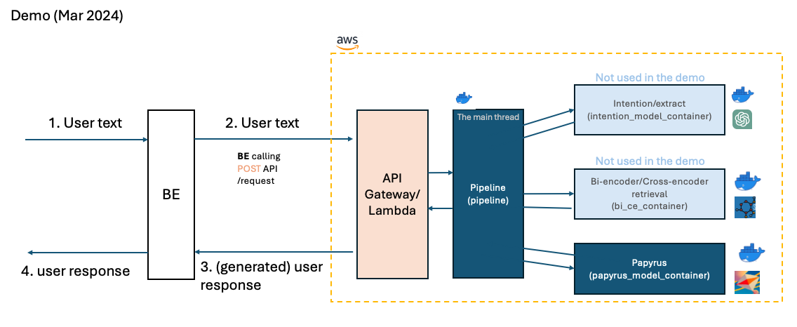

# [Work in Progress] DemoCollection
The centralized hub for the March 2024 demo.

Here is the high-level diagram:


User input goes to the main thread ("pipeline") first. The pipeline controls which sub-modules to run. 
The only submodule used in the demo was "Papyrus (papyrus_model_container)".

## The top-level directory layout

    .
    ├── assets/imgs                    # Image files for the README.md
    ├── bi_ce_container                # Bi-encoder/cross-encoder module
    ├── intention_model_container      # ChatGPT-3.5 intention module
    ├── papyrus_model_container        # Regex/solution generation module
    ├── pipeline_container             # Pipeline (the main thread)
    ├── utils                          # Tools and utilities
    ├── README.md
    └── requirements.txt               # Required libraries to install

## Set up the environment

### 1. Using the docker

Each container includes Dockerfile to build the docker image/run the docker container.
Please run the following:

### Build and run docker

- Pipeline docker. This is for the main thread. The user input goes to the main thread first.

```bash
docker build -t pipeline .
docker run -p 2222:2222 intention
```

- Bi-encoder/cross-encoder module docker

```bash
docker build -t bice .
docker run -p 8089:8089 bice
```

- Intention (ChatGPT-3.5) docker

```bash
docker build -t intention .
docker run -p 8888:8888 intention
```

- Papyrus (Regex/solution generation) docker

```bash
docker build -t papyrus .
docker run -p 8090:8090 intention
```

### 2. Running locally

- Create a new environment for the local test. If you have `conda` installed...

```bash
conda create --name <my-env> python=3.12
```

- Install necessary packages for the local test.

```bash
pip install -r requirements.txt
pip install xformers --index-url https://download.pytorch.org/whl/cu121
pip install "unsloth[cu121-torch220] @ git+https://github.com/unslothai/unsloth.git"
```

Please check your CUDA version and `torch` version. Please adjust the library to install accordingly.
The above assumes you have `CUDA==12.1` and `torch==2.2.0+cu121`

```bash
# CUDA
nvcc --version

# torch
pip list | grep torch
```

## 1. Testing with docker containers

Please make sure that you have images built and containers are running by following:

```bash
# check if the docker images are built
docker images

# check the docker containers are running
docker ps
```

### Test each docker container

- Using `health` endpoint. In the example below, we assume the docker
  containers are running on "http://ip-10-0-0-89.us-west-2.compute.internal"

```bash
# pipeline
curl -X GET "http://ip-10-0-0-89.us-west-2.compute.internal:2222/health"

# bi/ce
curl -X GET "http://ip-10-0-0-89.us-west-2.compute.internal:8089/health"

# intention
curl -X GET "http://ip-10-0-0-89.us-west-2.compute.internal:8888/health"

# papyrus regex/solution gen
curl -X GET "http://ip-10-0-0-89.us-west-2.compute.internal:8090/health"
```

### Run the example question

In the example below, we assume the docker containers are running on "http://ip-10-0-0-89.us-west-2.compute.internal"

- Check by running the main thread:

```bash
## Pipeline. Please note the X-Api-Key.
time curl -X POST "http://ip-10-0-0-89.us-west-2.compute.internal:2222/papyrusGen?conversation_id=conv_test_from_curl&message_id=msg_test_from_curl&source=netlens&dryrun=False&debug=False" -H "Content-Type: application/json" -H "X-Api-Key: 230e2b5e-fb08-405c-b9d2-f17e66be3b47" -d '{"user_input": "One of our network management systems has shown that memory utilization for a cat9200 switched named MRE-Edge2.cisco.com has been increasing. The device is attempting to send telemetry data to DNAC but the connection never establishes. I have noticed that the pubd process is consuming the majority of memory. The device is trying to send telemetry data to our DNAC, but it seems the receiver is responding with a device not found.  Is this a bug?", "nodes_run_data": []}'
```

- Check the rest of the modules

```bash
## bi/ce 
time curl -X POST http://ip-10-0-0-89.us-west-2.compute.internal:8089/query -H "Content-Type: application/json" -d '{"question": "One of our network management systems has shown that memory utilization for the device dtw-302-9300-sw-1 has been increasing. When I log into Catalyst Center, the device is not showing as managed. Today the switch had a log about memory value exceeding 90%. I have noticed that the 'pubd' process is consuming the majority of memory.  Is this a bug?"}'

# Intention module. Please note the X-Api-Key.
time curl -X POST http://ip-10-0-0-89.us-west-2.compute.internal:8888/dev -H "Content-Type: application/json" -H "X-Api-Key: 230e2b5e-fb08-405c-b9d2-f17e66be3b47" -d '{"user_input": "One of our network management systems has shown that memory utilization for a cat9200 switched named MRE-Edge2.cisco.com has been increasing. The device is attempting to send telemetry data to DNAC but the connection never establishes. I have noticed that the pubd process is consuming the majority of memory. The device is trying to send telemetry data to our DNAC, but it seems the receiver is responding with a device not found.  Is this a bug?"}'

## Papyrus regex/solution generation module
time curl -X POST http://ip-10-0-0-89.us-west-2.compute.internal:8090/generate -H 'Content-Type: application/json' -d '{"user_input_desc": "One of our network management systems has shown that memory utilization for a cat9200 switched named MRE-Edge2.cisco.com has been increasing. The device is attempting to send telemetry data to DNAC but the connection \\ never establishes. I have noticed that the pubd process is consuming the majority of memory. The device is trying to send telemetry data to our DNAC, but it seems the receiver is responding with a device not found.  Is this a bug?", "page_content": [], "run_papyrus_solution": true}'
```

## 2. Run locally

TBD

## Unittests

TBD.
